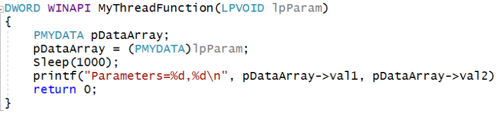
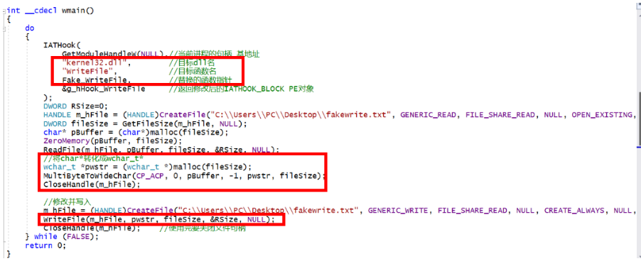

---

---

# Software Development

## 实验目录

- XSS攻击实验
- 缓冲区溢出实验
- hacked函数未调用进入
- 多线程实验
- 编写DLL、Load-Time与Run-time动态链接实验
- DLL注入
- 线程注入技术和IAT HOOK综合利用，实现对系统中进程的修改

## XSS攻击实验

### 相关知识
跨站脚本攻击（Cross Site Scripting)，为了不和层叠样式表 CSS 混淆，故将跨站脚本攻击缩写为 XSS)。恶意攻击者往 Web 页面里插入恶意 Script 代码，当用户浏览该页之时，嵌入其中 Web 里面的 Script 代码会被执行，从而达到恶意攻击用户的目的。

XSS 主要有如下三种分类：

- Reflected XSS（基于反射的 XSS攻击）：是指xss代码在请求的url中，而后提交到服务器，服务器解析后，XSS代码随着响应内容一起传给客户端进行解析执行。（直接反射显示在页面）
- Stored XSS（基于存储的 XSS攻击）：Stored XSS和 Reflected XSS的差别就在于，具有攻击性的脚本被保存到了服务器端（数据库，内存，文件系统）并且可以被普通用户完整的从服务的取得并执行，从而获得了在网络上传播的能力。

- DOM-based or local XSS（基于DOM或本地的 XSS 攻击）：DOM型 XSS其实是一种特殊类型的反射型 XSS，它是基于 DOM文档对象模型的一种漏洞。可以通过 DOM来动态修改页面内容，从客户端获取 DOM中的数据并在本地执行。基于这个特性，就可以利用 JS脚本来实现 XSS漏洞的利用。

### 实验环境

- Apache
- php

### 实验过程

- 前端代码

  

- 后端

  

- 注入`<script>alert('hi')</script>`,提交到后端，前端弹框，实验完成


## 缓冲区溢出实验

### 对于函数调用以及栈结构构造的理解

* 在函数调用时，首先进行的是参数传递的工作，有几个参数就进行几次push，我们把这个过程叫参数压栈，其中esp永远是栈顶指针  
* 在完成参数压栈之后，马上进行call指令执行。call指令会把它的下一条指令的地址入栈、，并跳转到被调用函数 的内部执行      
* 函数一开始的代码都是在进行栈结构的构造。
  * 保留旧的ebp
  * 把当前栈顶esp的位置作为新的ebp                  
  * 进行局部变量的内存空间开辟
  * 可能保留一些寄存器、
* esp可能变化很多次，但是ebp只变化一次。    
  * 不管当前的栈的绝对地址是多少，局部变量和参数相对于ebp的位置是固定的。
  * 保证了各个函数的独立性。才能实现不同的时间不同人编写的代码之间的相互可调用。  
* 随着函数的调用，栈在增长，调用完之后，栈在回退，回退到调用发生之时的那个位置。

### 实验验证&理解

- 实验代码    
  本代码基本结构是 main(int,char**)---调用sub(char*)---调用strcpy(char*,char*)      

- 观察反汇编     

  main对sub函数进行调用前要现将sub需要的参数push入栈     
  在push之前 栈顶数据如下图所示    

  

  在参数push入栈之后 栈顶数据如下图所示 （并观察到栈顶地址在减小）        
  入栈的是edx寄存器中存储的地址，在内存中观察这个地址，发现存储的是我们设置的参数“999……999”     

  

  完成参数压栈之后，马上进行call指令执行     
  观察到新入站了一个地址，且这个地址是main函数中call调用sub之后的下一条指令地址        

  

  进入sub函数内部之后，还要继续对栈进行构造        

  * 观察到将main函数的ebp入了栈    

  * 将当前栈顶esp的值赋给了ebp       

  * 将esp减了一个值（4ch），为栈分配了空间，供局部变量使用          

  * 保留了一些寄存器       

    

- 在sub函数内用main调用sub的同样形式调用strcpy函数            

  * 将strcpy(y,x)函数需要的两个参数push入栈 （参数循序反着push，先push x，再push y）    
  * call调用已经进入strcpy函数后的构造和之前同理    
  * 调用结束后，eip回到sub函数的 地址为00541676的位置       
    通过esp+8释放为strcpy函数分配的两个参数

  

- 要完全从sub退回main函数，还需要以下操作（strcpy退回sub函数同理）     
  - pop三个寄存器 恢复寄存器保存的值   
  - mov esp,ebp 释放sub函数局部变量空间   
  - pop ebp 归还ebp（sub）回到ebp（main）  
  - ret 返回main的地址出栈，将eip跳回到该位置，即回到main中的下一个执行语。这个语句是add esp,4，目的在于释放sub的那一个参数，这时候esp也就回到main的栈顶了    
    

### 安全性问题

设置visual studio 项目属性


在本实验中设置的sub函数的参数x的值是999……999，在栈帧中为sub的局部变量y[10]仅分配了Ch的空间，进行strcpy(y,x)，相当于将x的值拷贝到局部变量y ，这时局部变量y的值会在 ebp(sub)-Ch 处开始放置 ，结果就是sub栈帧中的ebp（main）和返回到main的地址等都被覆盖了，本身当进入sub函数，进行完ebp入栈时，栈帧的情况是这样的 

- 栈帧中入栈了返回地址004e15dimage\3- 和 ebp(main)地址 010ffcf0     

  

  

- 当strcpy计算结束,退回sub的栈帧后，可以看到栈帧的情况

  

- 所以在这种情况下，程序无法退回到main函数，会将ebp赋值为image\3-9image\3-9image\3-9image\3-9并尝试执行0ximage\3-9image\3-9image\3-9image\3-9处的代码，会错误终止

  

## hacked函数未调用进入

* 栈中保存了函数调用时的返回地址，缓冲区溢出的目的就是要将栈中保存的返回地址篡改成成溢出的数据，这样就间接修改了函数的返回地址，当函数返回时，就能跳转到预设的地址中，执行植入的代码。
* 为了看到实验效果 准备工作 设置visual studio 项目属性      
         
         
  
* 函数源代码
  * 实验目的就是实现：在不调用hacked()函数的基础上，进入hacked()函数，并输出“hacked！”字符串
  * 设置sub()的参数是"12image\3-412image\3-512image\3-612image\3-712image\3-8"
    
* 直接运行代码，会报以下错误
  * 这是由于在sub函数中，将长度很长的字符串x赋给了仅有10字节空间的y，导致溢出，覆盖了sub函数返回main函数的返回地址，详细的分析见实验二的md说明  
  * 此时返回地址变成了“0ximage\3-8image\3-image\3-image\3-2image\3-1”      
         
* 查阅AscII码表，发现0ximage\3-8image\3-image\3-image\3-2image\3-1对应的十进制是“12image\3-8”  
  * 由此可知，源代码中ov字符串的“12image\3-8”位置是返回地址对应的位置
  * 那么只要将目标hacked()函数的地址填写在“12image\3-8”对应的位置，那么sub函数运行完就会跳转进入hacked()函数     
    
* 为了防止每次hacked()函数的地址都不同，所以在最初准备工作中设置了基址，确保每次函数地址不变
  * 此时每次hacked()函数中的printf函数地址都是固定的，是0x21image\3-115c9
    
* 此时更改源代码的ov字符串，用0x21image\3-115c9代替12image\3-8的位置
  
* 再次运行，发现成功跳入了hacked()函数，输出了“hacked！”字符串
  
* 利用溢出的攻击实验成功

## 多线程实验

### 相关知识

* 程序、进程、线程
  * 程序：由源代码生成的可执行应用。
  * 进程：一个正在运行的程序可以看做一个进程，进程拥有独立运行所需要的全部资源
  * 线程：程序中独立运行的代码段。
  * 一个进程是由一或多个线程组成，进程只负责资源的调度和分配，线程才是程序真正的执行单元，负责代码的执行。
* 单线程
  * 每个正在运行的程序（即进程），至少包括一个线程，这个线程叫主线程
  * 主线程在程序启动时被创建，用于执行main函数
  * 只有一个主线程的程序，称作单线程程序
  * 主线程负责执行程序的所有代码。这些代码只能顺序执行，无法并发执行
* 多线程
  * 拥有多个线程的程序，称作多线程程序。
  * 相对于主线程来讲，其他线程，称为子线程
  * 子线程和主线程都是独立的运行单元，各自的执行互不影响，因此能够并发执行
* 单线程、多线程的区别
  * 单线程程序：只有一个线程，代码顺序执行，容易出现代码阻塞（页面假死）
  * 多线程程序：有多个线程，线程间独立运行，能有效地避免代码阻塞，并且提高程序的运行性能，但要占据更多的空间

### 实验

#### 单线程

代码  (#define MAX_THREADS 10)


* HeapAlloc是一个Windows API函数。它用来在指定的堆上分配内存，并且分配后的内存不可移动。
* GetProcessHeap用以获取和调用进程的堆句柄.
* pDataArray[i] = (PMYDATA)HeapAlloc(GetProcessHeap(), HEAP_ZERO_MEMORY,sizeof(MYDATA));即在堆内存上申请了一个不可移动的空间，大小为sizeof(MYDATA)

- 10个线程按顺序创建，按顺序调度 


#### 多线程

- 代码  (#define MAX_THREADS 10)

  

  

- 函数
  * 调用API:CreateThread可以创建一个新线程
  * lpThreadAttributes 默认安全属性时传入NULL
  * dwStackSize 用于指定线程初始时的栈大小，通常传入0即可，此时系统会使用一个合适的大小
  * lpStartAddress 就是新线程入口函数的地址
  * lpParameter 就是传入线程入口的参数，这个参数完全由调用者使用，系统只是简单的将这个参数传递给线程函数，并不做别的任何处理
  * dwCreationFlags 指出创建线程的方式，如果是0，表示线程一被创建就被立即执行
  * lpThreadId 则用于得到线程唯一的标识符
  * WaitForMultipleObjects 等待所有线程终止

- 10个线程是按顺序创建的，但线程的调度是随机的

  


## 编写DLL、Load-Time与Run-time动态链接实验

### 手动编译链接基础实验

- 在VS中新建一个项目，添加两个.c文件，a.c和b.c

  

- 手动编译链接文件

  * 编译用```cl.exe /c xxx.c```指令，其中/c代表只编译不链接
  * 可以发现编译成功，生成了a.obj和b.obj两个文件
  * 将两个obj文件进行链接，用```link a.obj b.obj /out:haha.exe```指令，将链接得到的exe文件输出为haha.exe。
  * 观察到成功链接，生成了可执行文件。

  * 执行起来也没有报错，手动编译链接成功。  

  * 现在将b.c内容进行更改，调用一个MessageBox系统函数，如下图  

    

  * 重新编译b.c生成新的b.obj文件

  * 将a.obj和新的b.obj进行链接，在链接的时候手动添加User32.lib文件

### run time动态链接

- 实验要求
  - 参考[链接](https://docs.microsoft.com/zh-cn/windows/win32/dlls/using-run-time-dynamic-linking)，使用run time的方式，调用dll的导出函数。
  - 系统API和第一步自行生成的dll，都要能成功调用。

- 原理分析
  * 两种方式的比较：
    * 装入时动态链接(Load-Time Dynamic Linking)
      * 用户源程序经编译后所得到的目标模块,是在装入内存时,边装入边链接的.即在装入一个目标模块时,若发生一个外部模块调用,将引起装入程序去找出相应的外部目标模块,并将它装入内存,还要修改目标模块中的相对地址。
      * 装入时动态链接方式有以下优点：
        * 便与软件版本的修改和更新
        * 便于实现目标模块共享：若采用装入时动态链接方式，OS能够将一个目标模块链接到几个应用模块，即实现多个应用程序对该模块的共享；然而，采用静态链接方式时每个应用模块都必须含有该目标模块的拷贝，否则无法实现共享。
      * 装入时动态链接方式有以下缺点：
        * 虽然可将装入模块装入到内存的任何地方，但装入模块的结构是静态的，它主要表现在两个方面：一是在进程的整个执行期间，装入模块不改变；再者是每次运行时的装入模块都是相同的。实际上，在许多情况下，每次要运行的模块可能是不相同的，但由于事先无法知道本次要运行哪些模块，故只能是将所有可能要运行到的模块，在装入时全部链接在一起，是每次执行时的装入模块是相同的。显然这是低效的。因为这样，在装入模块的运行过程中，往往会有某些目标模块根本就不运行。比较典型的例子是错误处理模块，如果程序在整个运行过程中，都不出现错误，便不会用到该模块。
    * 运行时动态链接（Run –Time Dynamic Linking）
      * 这种链接方式，可将某些目标模块的链接，推迟到执行时才进行。即在执行过程中，若发现一个被调用模块尚未装入内存时，才由OS去找到该模块，将它装入内存，并把它连接到调用者模块上。
      * 因为是在运行时进行动态链接，所以不必将模块与DLL的导入库链接。
      * 使用运行时动态链接即使DLL不可用的话，进程也能继续运行，然后进程可以通过一个变更方法达到最终目的。例如，如果进程不能找到一个DLL，它可以尝试另外一个或者向用户提示错误。如果用户可以提供丢失的DLL的全路径，进程就可以不管是否在正常的搜索路径中而使用该路径信息。（然而如果是载入时链接的话，系统就会终止，上一个实验也证明了这一点）


- 实验

  - 代码

    

  - 使用LoadLibrary函数获取指定DLL的句柄。如果LoadLibrary成功，则程序将使用GetProcAddress函数中返回的句柄来获取DLL的某一指定函数的地址。调用DLL函数后，程序将调用FreeLibrary函数以卸载DLL。

  - 当应用程序调用LoadLibrary函数时，系统会尝试定位DLL（方式和载入时动态链接的定位过程一致：①应用程序载入目录 ②当前目录 ③系统目录 等）。如果找到，系统就把DLL模块映射到进程的虚地址空间中，并增加引用计数。

  - 如果调用LoadLibrary时指定的DLL其代码已经映射到调用进程的虚地址空间，函数就会仅返回DLL的句柄并增加DLL引用计数。

  - 如果DLL不可用，运行时动态链接示例可以响应该错误。

  * 当dll不可用时，程序运行如下，可见不会像Load-Time链接一样弹框终止运行，而是正常报错。      

- 修改代码，调用系统User32.dll中的函数MessageBoxA      

  - 

    * 修改LoadLibrary参数、GetProcAddress参数    
    * 传入MessageBoxA函数的参数设为(0, "msg", 0, 0)
    * 程序会自己在系统目录找到User32.dll  
    * 运行结果直接调用MessageBoxA(0, "msg", 0, 0)是一致的，说明成功进行了运行时链接      
      

- 修改代码，调用之前实验生成的baselib.dll中的函数lib_function   

  

  * 修改LoadLibrary参数、GetProcAddress参数      
  * 传入lib_function函数的参数设为"dxy"     
  * 将baselib.dll copy到当前目录下  
  * 成功运行


## DLL注入

### 实验要求

* 查文档，研究远程线程方式注入dll的实例代码的实现原理。   
* 运行实例代码，向一个目标程序（比如notepad.exe)注入一个我们自行编写的dll，加载运行。    
* 整合进程遍历的程序，使得攻击程序可以自己遍历进程得到目标程序的pid。    

### 实验过程

- 查文档，研究远程线程方式注入dll的实例代码的实现原理     
  - DLL注入步骤 

    

  * OpenProcess获得要注入进程的句柄   

  * VirtualAllocEx在远程进程中开辟出一段内存，长度为strlen(dllname)+1;   

  * WriteProcessMemory将Dll的名字写入第二步开辟出的内存中。  

  * GetProcAddress得到Kernel32函数（在LoadLibraryW中）的实际地址。   

  * CreateRemoteThread将LoadLibraryW作为线程函数，参数为Dll的名称，即"baselib.dll"（绝对路径），创建新线程  

  * WaitForSingleObject等待对象句柄返回  

  * CloseHandle关闭线程句柄  

  * 加载了准备好的DLL（修改函数入口代码）， DLL被加载时我们可以在DLLMain中指定要执行的代码

    

- 运行实例代码，向一个目标程序（比如notepad.exe)注入一个我们自行编写的dll，加载运行  

  - 主函数逻辑      
    其中传入的demoCreateRemoteThreadW函数的参数     

    * 第一个参数为baselib.dll的绝对地址    

    * 第二个参数为目标的将要被注入的程序的pid（资源管理器中可以查到PID） 

      

  - 运行结果     

    

  - 由Process Explorer工具可以查找到此时baselib.dll确实注入到notepad.exe中

    

- 整合进程遍历的程序，使得攻击程序可以自己遍历进程得到目标程序的pid  

  - 将进程进行快照，循环进行依次遍历，若进程名为"notepad.exe"，则执行注入

    

  - 打开两个notepad.exe，则同理出现两次注入两个notepad.exe，结果和之前相同

    

    

  - 实验成功

## 线程注入技术和IAT HOOK综合利用，实现对系统中进程的修改

### 基础知识 

* DLL 注入+ API hook技术实现对软件行为的篡改，是实现文件或者进程隐藏，外挂等的基础技术。
* IAT hook 是API hook的一种，API hook是通过修改函数的地址从而达到篡改程序行为的一种技术。
* IAT hook 原理理解：
  * IAT : 导入地址表
  * 导入表的位置是固定的，但是表里面的值是变的
  * 每次运行之前都要把指针的值搞定
  * 可理解为信箱是导入表，目的函数的地址从约定好的信箱获取，黑客可以结构PE文件，找到对应信箱，修改信箱中的内容，替换原本存在的真实系统函数的地址，使得系统调用了一个假函数。

### 实验过程

#### 用IAT hook技术替换WriteFile()函数

* 目的：使用IAT hook技术将txt文件中的所有“呵呵”替换成“哈哈”

* 主函数wmain的代码逻辑

  

  - IATHook()函数实现：找到导入表中kernel32.dll的WriteFile函数对应的位置，将地址用自己编写的Fake_WriteFile函数地址替换，这样当程序调用kernel32.dll的WriteFile函数时，其实是调用的Fake_WriteFile

  - 反汇编观察地址变化
    - 在没有执行IATHook函数的时候，调用WriteFile函数时，通过反汇编可看到call函数目的地址存在dword ptr ds:[00B9B010h] 内存位置，查看内存，发现地址是0x775d4320      

      

    - 执行IATHook函数之后，发现该内存位置存储的地址发生了改变，变为了0x00B910a5   

      

    - 我们也可以看到0x00B910a5位置处确实是jmp到Fake_WriteFile函数的语句，所以IAT Hook成功

      

- 然后用ReadFile函数读入fakewrite.txt文件，将文件中的内容用MultiByteToWideChar转化成宽字节的Unicode编码格式，方便处理中文字符

- 将读入的信息再次用WriteFile函数写回fakewrite.txt文件，此时的WriteFile函数调用的是Fake_WriteFile函数，该函数代码如下 

  

  * 要获取原WriteFile函数的指针 
  * 将字符串中所有的“呵”字都用“哈”字替换（注意是宽字符格式）
  * 将修改后的宽字符串用WideCharToMultiByte转化成ANSI或者UTF8编码格式（根据notepad的编码格式不同而不同）
  * 调用原函数将修改后的字符串写入fakewrite.txt文件

- 运行此程序可以观察到内容成功替换

#### 把IAT hook的代码包装成dll文件

- 在hook.c文件中添加DLLMain函数，在DLL_PROCESS_ATTACH情况下调用以上的wmain函数

  

- 添加exp.def文件，添加要导出的函数wmain

  

- 修改项目配置属性

  

  

- 生成hook.dll文件

#### 将该dll文件注入目标notepad.exe  

- 整合进程遍历的程序，使得攻击程序可以自己遍历进程得到目标程序的pid ，进行我们编写的hook.dll的注入
- 打开32位的notepad.exe向其中写入 并保存为fakewrite.txt文件

- 不要关闭这个fakewrite.txt文件  

- 直接运行dll注入程序，显示注入成功

  

- 查看文件内容已经被替换，实验成功